## 背包问题

假设你是个小偷，背着一个可装4磅东西的背包。

你可盗窃的商品有如下3件。为了让盗窃的商品价值最高，你该选择哪些商品？

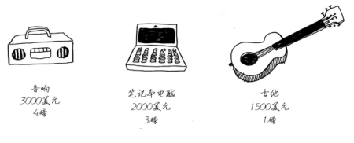

## 动态规划

动态规划先解决子问题，再逐步解决大问题。

对于背包问题，你先解决小背包（子背包）问题，再逐步解决原来的问题。

每个动态规划算法都从一个网格开始，背包问题的网格如下。

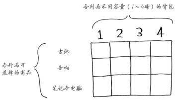

网格的各行是商品，各列为不同容量（1～4磅）的背包。所有这些列你都需要，因为它们将帮助你计算子背包的价值。

网格最初是空的。你将填充其中的每个单元格，网格填满后，就找到了问题的答案！

### 第一行

首先来看第一行。

这是吉他行，意味着你将尝试将吉他装入背包。在每个单元格，都需要做一个简单的决定：偷不偷吉他？别忘了，你要找出一个价值最高的商品集合。

第一个单元格表示背包的容量为1磅。吉他的重量也是1磅，这意味着它能装入背包！因此这个单元格包含吉他，价值为1500美元。

下面来开始填充网格。

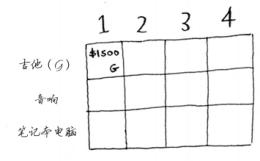

与这个单元格一样，每个单元格都将包含当前可装入背包的所有商品。

来看下一个单元格。这个单元格表示背包的容量为2磅，完全能够装下吉他！

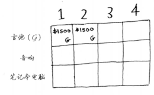

这行的其他单元格也一样。别忘了，这是第一行，只有吉他可供你选择。换言之，你假装现在还没法盗窃其他两件商品。

|            | 1    | 2           | 3    | 4    |
| ---------- | ---- | ----------- | ---- | ---- |
| 吉他       |  $1500(吉他)    | $1500(吉他) | $1500(吉他)     |   $1500(吉他)   |
| 音箱       |      |             |      |      |
| 笔记本电脑 |      |             |      |      |

此时你很可能心存疑惑：原来的问题说的是4磅的背包，我们为何要考虑容量为1磅、2磅等的背包呢？前面说过，动态规划从小问题着手，逐步解决大问题。这里解决的子问题将帮助你解决大问题。请接着往下读，稍后你就会明白的。

这行表示的是当前的最大价值。它指出，如果你有一个容量4磅的背包，可在其中装入的商品的最大价值为1500美元。

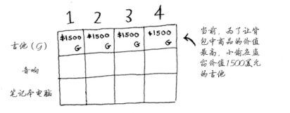

你知道这不是最终的解。随着算法往下执行，你将逐步修改最大价值。

### 第二行

我们来填充下一行——音响行。你现在出于第二行，可偷的商品有吉他和音响。在每一行，可偷的商品都为当前行的商品以及之前各行的商品。因此，当前你还不能偷笔记本电脑，而只能偷音响和吉他。我们先来看第一个单元格，它表示容量为1磅的背包。在此之前，可装入1磅背包的商品的最大价值为1500美元。

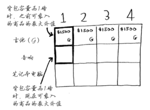

该不该偷音响呢？

背包的容量为1磅，能装下音响吗？音响太重了，装不下！由于容量1磅的背包装不下音响，因此最大价值依然是1500美元。

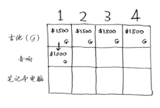

接下来的两个单元格的情况与此相同。在这些单元格中，背包的容量分别为2磅和3磅，而以前的最大价值为1500美元。

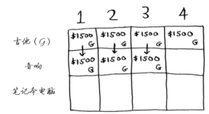

由于这些背包装不下音响，因此最大价值保持不变。

背包容量为4磅呢？终于能够装下音响了！原来的最大价值为1500美元，但如果在背包中装入音响而不是吉他，价值将为3000美元！因此还是偷音响吧。

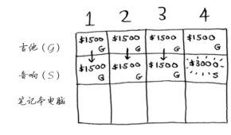

你更新了最大价值！如果背包的容量为4磅，就能装入价值至少3000美元的商品。在这个网格中，你逐步地更新最大价值。

### 第三行

下面以同样的方式处理笔记本电脑。笔记本电脑重3磅，没法将其装入容量为1磅或2磅的背包，因此前两个单元格的最大价值还是1500美元。

|            | 1    | 2    | 3    | 4    |
| ---------- | ---- | ---- | ---- | ---- |
| 吉他       | $1500(吉他)      |  $1500(吉他)     |   $1500(吉他)    |  $1500(吉他)     |
| 音箱       |  $1500(吉他)     | $1500(吉他)      |   $1500(吉他)    | $3000(音箱)      |
| 笔记本电脑 | $1500(吉他)      |   $1500(吉他)    |      |      |

对于容量为3磅的背包，原来的最大价值为1500美元，但现在你可选择盗窃价值2000美元的笔记本电脑而不是吉他，这样新的最大价值将为2000美元！

|            | 1    | 2    | 3    | 4    |
| ---------- | ---- | ---- | ---- | ---- |
| 吉他       | $1500(吉他)      |  $1500(吉他)     |   $1500(吉他)    |  $1500(吉他)     |
| 音箱       |  $1500(吉他)     | $1500(吉他)      |   $1500(吉他)    | $3000(音箱)      |
| 笔记本电脑 | $1500(吉他)      |   $1500(吉他)    | $2000(笔记本电脑) |      |

对于容量为4磅的背包，情况很有趣。这是非常重要的部分。当前的最大价值为3000美元，你可不偷音响，而偷笔记本电脑，但它只值2000美元。价值没有原来高。但等一等，笔记本电脑的重量只有3磅，背包还有1磅的容量没用！

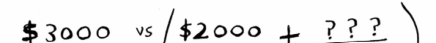 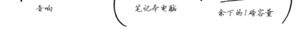

在1磅的容量中，可装入的商品的最大价值是多少呢？你之前计算过。

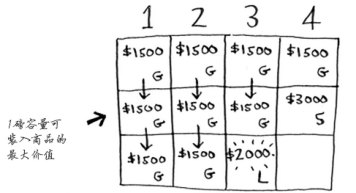

根据之前计算的最大价值可知，在1磅的容量中可装入吉他，价值1500美元。因此，你需要做如下比较。

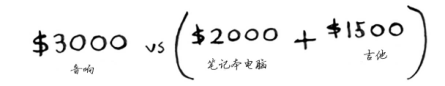

你可能始终心存疑惑：为何计算小背包可装入的商品的最大价值呢？但愿你现在明白了其中的原因！**余下了空间时，你可根据这些子问题的答案来确定余下的空间可装入哪些商品**。笔记本电脑和吉他的总价值为3500美元，因此偷它们是更好的选择。

最终的网格类似于下面这样。

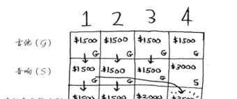 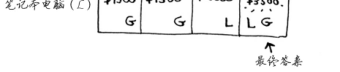

答案如下：将吉他和笔记本电脑装入背包时价值最高，为3500美元。

你可能认为，计算最后一个单元格的价值时，我使用了不同的公式。那是因为填充之前的单元格时，我故意避开了一些复杂的因素。其实，计算每个单元格的价值时，使用的公式都相同。这个公式如下。

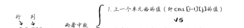 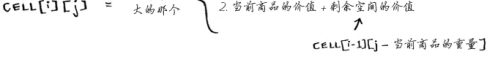

你可以使用这个公式来计算每个单元格的价值，最终的网格将与前一个网格相同。现在你明白了为何要求解子问题吧？你可以合并两个子问题的解来得到更大问题的解。