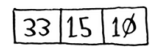

## 分而治之

使用D&C解决问题的过程包括两个步骤。

1. 找出基线条件，这种条件必须尽可能简单。
2. 不断将问题分解（或者说缩小规模），直到符合基线条件。

> 每个递归函数都有两部分：基线条件（base case）和递归条件（recursive case）。
>
> 递归条件指的是函数调用自己，而基线条件则指的是函数不再调用自己，从而避免形成无限循环。


## 基线条件

对排序算法来说，最简单的数组什么样呢？也就是基线条件是什么呢？就是根本不需要排序的数组。


因此，基线条件为数组为空或只包含一个元素。在这种情况下，只需原样返回数组——根本就不用排序。

```python
def quicksort(array):
    if len(array) < 2:
        return array
```

## 递归条件

我们来看看更长的数组。对包含两个元素的数组进行排序也很容易。


包含三个元素的数组呢？



别忘了，你要使用D&C，因此需要将数组分解，直到满足基线条件下面介绍快速排序的工作原理。首先，从数组中选择一个元素，这个元素被称为基准值（pivot）。

我们暂时将数组的第一个元素用作基准值。接下来，找出比基准值小的元素以及比基准值大的元素。

<br/>

这被称为分区（partitioning）。现在你有：

* 一个由所有小于基准值的数字组成的子数组；
* 基准值；
* 一个由所有大于基准值的数组组成的子数组。

这里只是进行了分区，得到的两个子数组是无序的。但如果这两个数组是有序的，对整个数组进行排序将非常容易。如果子数组是有序的，就可以像下面这样合并得到一个有序的数组：左边的数组 + 基准值 + 右边的数组。在这里，就是[10, 15] + [33] + []，结果为有序数组[10, 15, 33]。

如何对子数组进行排序呢？对于包含两个元素的数组（左边的子数组）以及空数组（右边的子数组），快速排序知道如何将它们排序，因此只要对这两个子数组进行快速排序，再合并结果，就能得到一个有序数组！

```python
quicksort([15, 10]) + [33] + quicksort([])
> [10, 15, 33]  # 一个有序数组
```

不管将哪个元素用作基准值，这都管用。


## 代码实现

```python
def quicksort(array):
    if len(array) < 2:  # 基线条件：为空或只包含一个元素的数组是“有序”的
        return array  
    else:  # 递归条件
        pivot = array[0]  
        less = [i for i in array[1:] if i <= pivot]  # 由所有小于基准值的元素组成的子数组
        greater = [i for i in array[1:] if i > pivot]  # 由所有大于基准值的元素组成的子数组
        return quicksort(less) + [pivot] + quicksort(greater)
print quicksort([10, 5, 2, 3])
```

