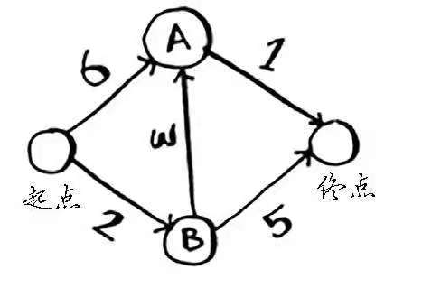
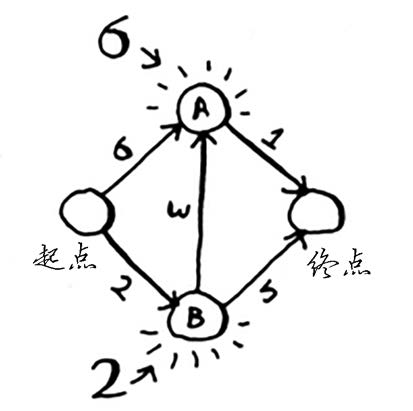
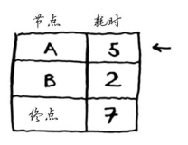
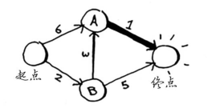
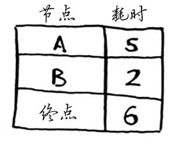
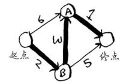
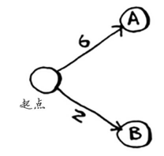
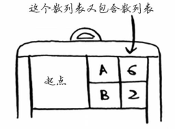
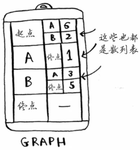
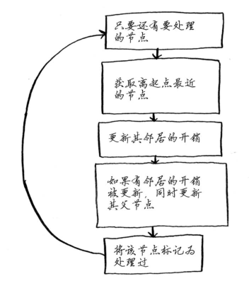

## 问题

找出从 A 到 B 时间最少的路径？



其中每个数字表示的都是时间，单位为分钟。为找出从起点到终点耗时最短的路径，这里使用**狄克斯特拉算法**。它包含如下四个步骤：

1. 找出“最便宜”的节点，即可在最短时间内到达的节点
2. 更新该节点的邻居的开销，其含义将稍后介绍。
3. 重复这个过程，知道对图中每个节点都这样做了。
4. 计算最终路径。

## 解析过程

### 第一步：找出最便宜的节点。

你站在起点，不知道该前往节点A还是前往节点B。前往这两个节点都要多长时间呢？



前往节点A需要6分钟，而前往节点B需要2分钟。至于前往其他节点，你还不知道需要多长时间。

由于你还不知道前往终点需要多长时间，因此你假设为无穷大（这样做的原因你马上就会明白）。节点B是最近的——2分钟就能达到。


### 第二步：计算经节点B前往其各个邻居所需的时间。

对于节点B的邻居，如果找到前往它的更短路径，就更新其开销。在这里，你找到了：

- 前往节点A的更短路径（时间从6分钟缩短到5分钟）；

- 前往终点的更短路径（时间从无穷大缩短到7分钟）。


### 第三步：重复！

**重复第一步**：找出可在最短时间内前往的节点。你对节点B执行了第二步，除节点B外，可在最短时间内前往的节点是节点A。



**重复第二步**：更新节点A的所有邻居的开销



你发现前往终点的时间为6分钟！

你对每个节点都运行了狄克斯特拉算法（无需对终点这样做）。现在，你知道：

* 前往节点B需要2分钟；
* 前往节点A需要5分钟；
* 前往终点需要6分钟。



### 最后一步—计算最终路径



更加上面列出的表格，可得知到终点的最小耗时为6，经过的节点有B、A。


## 代码实现

要编写解决这个问题的代码，需要三个散列表。


随着算法的进行，你将不断更新散列表 costs 和 parents。

### 1、GRAPH

首先，需要实现这个图，为此可使用一个散列表。

```python
graph = {}
```

这里需要同时存储邻居和前往邻居的开销。例如，起点有两个邻居——A和B。



如何表示这些边的权重呢？为何不使用另一个散列表呢？

```python
graph["start"] = {}
graph["start"]["a"] = 6
graph["start"]["b"] = 2
```



表示整个图的散列表类似于下面这样。



接下来，需要用一个散列表来存储每个节点的开销。

### 2、COSTS

<p style="color:red">节点的开销指的是从起点出发前往该节点需要多长时间。<p>

你知道的，从起点到节点B需要2分钟，从起点到节点A需要6分钟（但你可能会找到所需时间更短的路径）。你不知道到终点需要多长时间。对于还不知道的开销，你将其设置为无穷大。在Python中能够表示无穷大吗？你可以这样做：

```python
infinity = float("inf")
```


### 3、parent

还需要一个存储父节点的散列表：


最后，你需要一个数组，用于记录处理过的节点，因为对于同一个节点，你不用处理多次。

```python
processed = []
```


### 4、算法



### 数据结构

需要三个散列表：`graph`、`costs`、`parents`

#### graph

```python
# 起点的邻居
graph['start'] = {}
graph['start']['a'] = 6
graph['start']['b'] = 2

# a节点的邻居
graph['a'] = {}
graph['a']['fin'] = 1

# b节点的邻居
graph['b'] = {}
graph['b']['a'] = 3
graph['b']['fin'] = 5

# 终点没有任何邻居
graph['fin'] = {}
```

因此 `graph[start]` 是一个散列表，起点的邻居可以这样获取：

```python
graph['start'].keys()
```

#### costs: 从起点出发，前往该节点需要多长时间

```python
infinity = float('inf')  # 无限大
costs = {}
costs['a'] = 6
costs['b'] = 2
costs['fin'] = infinity
```

#### parents：存储父节点

```python
parents = {}
parents['a'] = 'start'
parents['b'] = 'start'
parents['fin'] = None
```

最后，还需要一个数组，用于记录处理过的节点。


## 代码

```python
node = find_lowest_cost_node(costs)
while node is not None:
    cost = costs[node]
    neighbors = graph[node]
    # 遍历邻居
    for n in neighbors.keys():
        new_cost = cost + neighbors[n]
        if costs[n] > new_cost:  # 如果当前节点前往该邻居节点更近
            costs[n] = new_cost  # 更新该邻居的开销
            parents[n] = node    # 同时将当前节点设置为该邻居的父节点
    processed.append(node)
    node = find_lowest_cost_node(costs)
```

查找花销最小的节点

```python
def find_lowest_cost_node(costs):
    lowest_cost = float("inf")
    lowest_cost_node = None
    for node in costs:
        cost = costs[node]
        if cost < lowest_cost and node not in processed:
            lowest_cost = cost
            lowest_cost_node = node
    return lowest_cost_node
```

