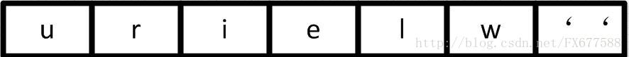
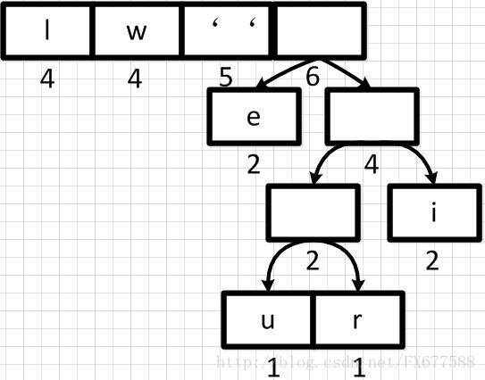
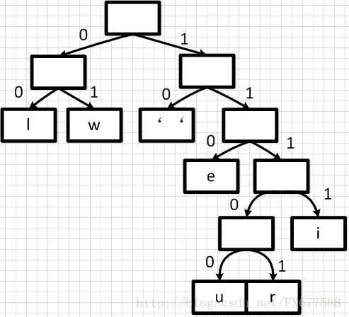
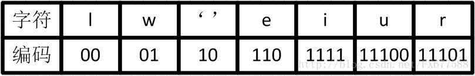

【转载自】[详细图解哈夫曼Huffman编码树](https://blog.csdn.net/fx677588/article/details/70767446)

## 1、引言

哈夫曼（Huffman）编码算法是基于二叉树构建编码压缩结构的，它是数据压缩中经典的一种算法。算法根据文本字符出现的频率，重新对字符进行编码。因为为了缩短编码的长度，我们自然希望频率越高的词，编码越短，这样最终才能最大化压缩存储文本数据的空间。

假设现在我们要对下面这句歌词 `we will we will r u` 进行压缩。我们可以想象，如果是使用 ASCII 码对这句话编码结果则为：`119 101 32 119 105 108 108 32 119 101 32 119 105 108 108 32 114 32 117`（十进制表示）。我们可以看出需要19个字节，也就是至少需要152位的内存空间去存储这些数据。

很显然直接 ASCII 码编码是很浪费空间的，Unicode 就更不用说了，下面我们先来统计一下这句话中每个字符出现的频率。如下表，按频率高低已排序：


## 2、哈夫曼二叉树构建


### 2.1、初始队列

那么我们按出现频率高低将其放入一个优先级队列中，从左到右依次为频率逐渐增加。



下面我们需要将这个队列转换成哈夫曼二叉树，哈夫曼二叉树是一颗带权重的二叉树，权重是由队列中每个字符出现的次数所决定的。并且哈夫曼二叉树**始终保证**权重越大的字符出现在越高的地方。


### 2.2、第一步合并

首先我们从左到右进行合并，依次构建二叉树。第一步取前两个字符 `u` 和 `r` 来构造初始二叉树，第一个字符作为左节点，第二个元素作为右节点，然后两个元素相加作为新空元素，并且两者权重相加作为新元素的权重。


同理，新元素可以和字符 `i` 再合并，如下：


### 2.3、重新调整队列

上图新元素权重相加后结果是变大了，需要对权重进行重新排序。


然后再依次从左到右合并，每合并一次则进行一次队列重新排序调整。如下：



经过多步操作之后，得到以下的哈夫曼二叉树结构，也就是一个带有权重的二叉树：


### 2.4、哈夫曼编码

有了上面带权重的二叉树之后，我们就可以进行编码了。我们把二叉树分支中左边的支路编码为 0，右边分支表示为 1，如下图：



这样依次遍历这颗二叉树就可以获取得到所有字符的编码了。例如：`' '` 的编码为 `10`，`l` 的编码为 `00`，`u` 的编码为 `11100` 等等。

经过这个编码设置之后我们可以发现，出现频率越高的字符越会在上层，这样它的编码越短；出现频率越低的字符越会在下层，编码越短。经过这样的设计，最终整个文本存储空间才会最大化的缩减。

最终我们可以得到下面这张编码表：




### 2.5、字符串编码

有了上面的编码表之后，`we will we will r u` 这句重新进行编码就可以得到很大的压缩，编码表示为：`01 110 10 01 1111 00 00 10 01 110 10 01 1111 00 00 10 11101 10 11100`。这样最终我们只需50位内存，比原 ASCII 码表示节约了2/3空间，效果还是很理想的。当然现实中不是简单这样表示的，还需要考虑很多问题。

## 3、补充

我们需要弄明白哈夫曼二叉树概念，它是带权路径达到最小的二叉树，也叫最优二叉树。它不一定是完全二叉树，也不一定是平衡二叉树，它们描述的完全不是一件事情，完全没有概念上的重叠关系。


> 原文链接：https://blog.csdn.net/fx677588/article/details/70767446

---


## 代码实现

### 1、定义 **霍夫曼树 node** 数据结构

```java
//霍夫曼树节点
private static class Node implements Comparable<Node>{
    //叶子节点表示编码字符  非叶子节点为空
    private char ch;
    //字符出现的频率
    private int freq;
    private final Node left, right;
    Node(char ch, int freq, Node left, Node right) {
        this.ch = ch;
        this.freq = freq;
        this.left = left;
        this.right = right;
    }
    public boolean isLeaf(){
        return left==null && right==null;
    }
    //后面使用优先级队列来保存Node节点  注意Node节点排序规则  freq小的在前 
    @Override
    public int compareTo(Node o) {
        return this.freq - o.freq;
        //return o.freq - this.freq;
    }

    @Override
    public String toString() {
        StringBuilder builder = new StringBuilder();
        builder.append("Node [ch=");
        builder.append(ch);
        builder.append(", freq=");
        builder.append(freq);
        builder.append(", left=");
        builder.append(left);
        builder.append(", right=");
        builder.append(right);
        builder.append("]");
        return builder.toString();
    }	
}
```

由于后续要根据节点的字符频率 `freq` 来进行排序，因此 `Node` 实现了 `Comparable` 接口。

假定待编码字符串为 ASCII 字符，取字母表基数为 `R=256`，利用数组索引来统计记录**字符及出现频率**的关系。

```java
char[] input = s.toCharArray();

//要压缩的字符串字符个数
int total = input.length;

//统计字符串中每个字符出现的频率
int[] freq = new int[R];

for(int i=0; i<total; i++){
    freq[input[i]]++;
}
System.out.println("freq = " + Arrays.toString(freq));  
```


### 2、霍夫曼树的构造

使用优先级队列，遍历字符索引数组，将出现的字符以及频率，依次加入到优先级队列中并根据出现频率来进行降序排列；

循环操作，每次取出队列中的最小值以及次小值，将两个节点合并成一个新节点，新节点频率为两者之和，新节点左右孩子为两者，将新节点加入到优先级队列中排序，依次循环，直到队列中只有一个节点，此时该节点即为霍夫曼树的根节点。

```python
private static Node buildTree(int[] freq) {
    PriorityQueue<Node> pq = new PriorityQueue<>();
    
    for(int i=0; i<freq.length; i++){
        if(freq[i]>0){
            //System.out.println((char)i);
            pq.add(new Node((char)i, freq[i], null, null));
        }
    }
    System.out.println("pq = " + pq.toString());

    while(pq.size()>1){
        Node l1 = pq.poll();
        Node l2 = pq.poll();
        //System.out.println(l1.ch + " " + l1.freq + " " + l2.ch + " " + l2.freq);
        pq.add(new Node('\0', l1.freq+l2.freq, l1, l2));
    }			
    return pq.poll();
}
```


> 实现：[霍夫曼编码实现讲解](https://blog.csdn.net/u014106644/article/details/90050977)
>
> 代码地址：[huffman.java](https://github.com/ChenWenKaiVN/TreeSWT/blob/master/src/com/tree/string/compress/Huffman.java)

