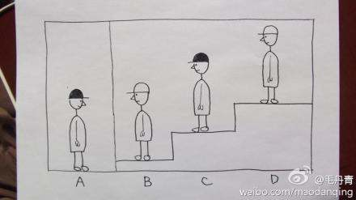

#### 选择题

1. 黑盒测试流程正确的顺序是（A）? (5.0分)

   A 、 需求评审->用例设计->用例评审->送代测试->回归测试->集成测试->回归测试->上线测试

   B 、 需求评审->迭代测试->编写测试用例->用例评审集成测试->回归测试->上线测试

   C  、需求评审->编写测试用例->迭代测试->用例评审->集成测试->回归测试->上线测试

   D 、 编写测试用例->需求评审->迭代测试->用例评审->集成测试->回归测试->上线测试

2. 列哪种方法设计出的测试用例发现程序错误的能力最强（A）? (5.0分)

   A 、边界值分析法             B 、决策表法                  C 、等价类划分法                      D、场景法

3. 单元测试框架如Junit4中@BeforeClass，@Before，@AfterClass，@After，@Test所标的方法，执行顺序正确的是？（D）（5.0分）

   A、@BeforeClass，@Before，@AfterClass，@After是必须写的

   B、@Before和@AfterClass在测试执行中，只会执行一次

   C、@Test的测试程序，必须以test开关

   D、@BeforeClass和@AfterClass在测试过程中，只会执行一次

   解析：Unit4使用Java5中的注解（annotation），以下是JUnit4常用的几个annotation： 
   @Before：初始化方法   对于每一个测试方法都要执行一次（注意与BeforeClass区别，后者是对于所有方法执行一次）
   @After：释放资源  对于每一个测试方法都要执行一次（注意与AfterClass区别，后者是对于所有方法执行一次）
   @Test：测试方法，在这里可以测试期望异常和超时时间 

   @Test(expected=ArithmeticException.class)检查被测方法是否抛出ArithmeticException异常 

   @Ignore：忽略的测试方法 

   @BeforeClass：针对所有测试，只执行一次，且必须为static void 

   @AfterClass：针对所有测试，只执行一次，且必须为static void 

   一个JUnit4的单元测试用例执行顺序为:
   @BeforeClass -> @Before -> @Test -> @After -> @AfterClass

   每一个测试方法的调用顺序为:
   @Before -> @Test -> @After

4. 对于一个含有n个变量的程序，采用基本边界值分析法测试程序会产生（A）个测试用例。

   A、6n+1          B、7n            C、4n+1           D、5n

5. TCP三次握手过程描述正确的是？（D）

   Client SYN=1，seq=0

   Server SYN=1，ACK=1，seq=0，ack=（x=0+1）

   Client ACK=1，seq=1，ack=（y=0+1）

   A、2，1           B、2，2         C、1，2          D、1，1

   解析：tcp三次握手过程：ACK是确认标志位

   1、首先由Client发出请求连接即SYN=1，明自己的序号是seq=x :

   2、然后Server 进行回复确认，即SYN=1，声明自己的号是seq=y，并设置为ack=x+1

   3、最后Client 再进行 一 次确认，seq=x+1，ack=y+1.

   seq例号范围：2^32 -1到最大值,再从0开始

   seq例号作用：依据这个例号来组数据进行数据包的顺序

6. 一堆数据进行入栈出栈操作，入栈顺序为{a,b,c,d,e,f,g}，可能的出栈顺序为（C）

   A、{e,f,d,g,b,c,a}           B、{c,d,e,f,a,g,b}        C、{d,e,c,f,b,g,a}       D、{f,e,g,d,b,a,c}

   解析：注意出栈操作可以和入栈操作间隔进行，栈为“先进后出”。

7. 程序的完整编译过程分为是：预处理，编译，汇编等，如下关于编译阶段的编译优化的说法不正确的是（D）

   A、For循环的循环过程控制变量通常很适合调度到寄存器访问

   B、强度削弱是指执行时间较短的指令等价的替代执行时间较长的指令        

   C、函数内联可以避免函数调用中压栈和退栈的开始

   D、死代码删除指的是编译过程直接抛弃掉被注释的代码

8. 32位Windows系统中，short（signed short int）类型的取值范围是？（D）（5.0分）

   A、-32767~-32768           B、 0~65535       C、 0~65536       D、-32768~-32767

9. 根据以下提供的数列寻找规律，选择正确答案：10，22，-6，14，_B___。

   A、26           B、-10        C、  4      D、-14

   解析：10+22=32=2^5，22+（-6）=16=2^4，（-6）+14=8=2^3，14+X=2^2，X = 10

10. 一次投掷两个骰子，请问投掷之后两个骰子数值之和为9的概率是多少？（D）（5.0分）

    A、3/36        B、5/36       C、6/36      D、4/36

11. 有4个人，分别是ABCD，每个人都头上都带了个帽子，帽子只有黑色或白色，4个人中分别有两个人带黑色，有两个人带白色，4个人的站位是A|B C D，|是一堵墙，B,C,D分别站在平地，一层台阶，二层台阶上，每个人都看不到自己带的帽子，一开始大家都不讲话，突然有个人说，我知道自己带的什么颜色的帽子了，请问是谁（A）？

    A、C        B、D        C、A      D、B

    解答：有个隐藏条件没说：A与B，C，D之间有堵墙，所以看不见，同时谁都不能摘下帽子看，也不能回头看。

    

    如果能直接判断，那么一定是D，因为它可以看到B、C，但是D沉默了，所以C判断B与自己异色，C又能看到B帽颜色，所以是C知道了自己帽子的颜色。

    

1、七层网络模型，介绍下每一层，TCP在第几层，TCP、UDP是什么，有什么区别？

2、测试流程？

3、什么是边界值法和等价类划分法，两者区别？

4、有500毫升、600毫升的杯子，倒出300毫升水？

5、多表查询会吗？左连接、又连接？自己建表随便写一个？（麻蛋我写了内连接查询？面试官说没用过……）

6、python生成100个不重复的4位数随机数。

7、HTTP返回码？（我只答了2345开头的，其实还有1和6开头的）